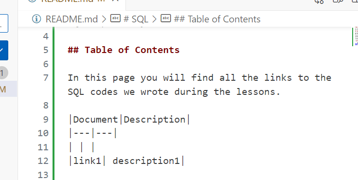

# SQL

SQL Repository

## Let's get started to .md

In this page you will find all the links to the SQL codes we wrote during the lessons.

It follows a basic introduction to the markdown characters to compile a README.md

|Document|Description|
|---|---|
| | |
|link1| description1|

`inserire del codice`

``` sql
SELECT *
FROM Sales.Orders
```



If you are looking for some other info you can use:

- [Markdown Guide](https://www.markdownguide.org/)

- [GitHub Flavored Markdown Spec](https://github.github.com/gfm/)

- [Github syntax](https://docs.github.com/en/get-started/writing-on-github/getting-started-with-writing-and-formatting-on-github/basic-writing-and-formatting-syntax)
